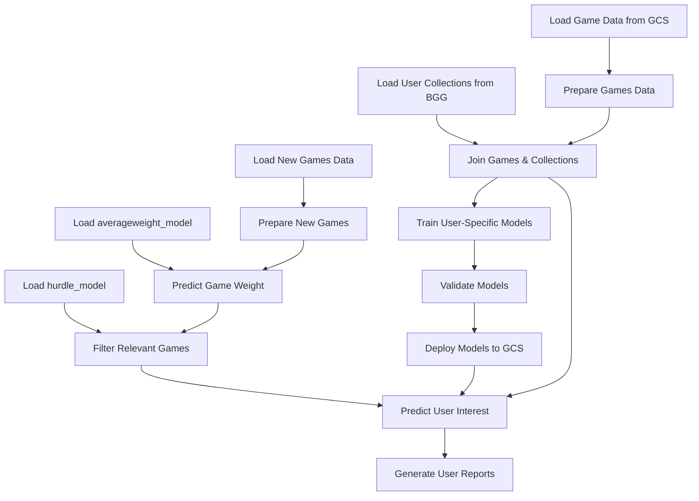

# BGG Collections

A machine learning project for predicting board game collections based on BoardGameGeek (BGG) data.

## Workflow Diagram

## Project Overview

This project builds predictive models for individual board game collections using data from BoardGameGeek. The models learn patterns in a user's collection and predict which new or upcoming games they are likely to enjoy based on game features such as mechanics, categories, designers, publishers, and more.

The project uses two additional pre-trained models from the `bgg_model_board`:
1. **averageweight_model**: Predicts the complexity/weight of games
2. **hurdle_model**: Filters games based on relevance criteria (with a threshold of 0.25)

These models are used in preprocessing new games before making user-specific predictions.

### Key Features

- **User-specific models**: Trains personalized models for each BGG user's collection
- **Prediction capabilities**: Predicts which new and upcoming games a user is likely to add to their collection
- **Comprehensive analysis**: Provides detailed insights into what features predict a user's preferences
- **Interactive reports**: Generates interactive Quarto reports with visualizations and tables

## Technical Details

### Data Sources

- **BoardGameGeek API**: User collections and game data
- **Google Cloud Storage**: Storage for game data, models, and reports

### Model Architecture

- **Classification models**: Primarily uses penalized logistic regression (glmnet) to predict the probability a user will own a game
- **Feature engineering**: Processes game attributes including mechanics, categories, designers, publishers, and more
- **Evaluation**: Uses resampling and validation sets to assess model performance

### Pipeline

The project uses the {targets} package to create a reproducible workflow:

1. **Data loading**: Fetches game data from Google Cloud Storage and user collections from BGG
2. **Data preparation**: Processes and joins game data with user collections
3. **Model training**: Trains models on historical games via resampling
4. **Validation**: Evaluates models on a set-aside validation set
5. **Prediction**: Predicts upcoming releases to find new games users might enjoy
6. **Reporting**: Generates interactive reports for each user

### Technologies Used

- **R**: Primary programming language
- **tidymodels**: Framework for modeling and machine learning
- **Quarto**: For report generation
- **Google Cloud Storage**: For data and model storage
- **targets**: For reproducible workflows

## Reports

The project generates two types of reports:

1. **Main index**: Overview of all models with comparisons between users
2. **User-specific reports**: Detailed analysis of an individual user's collection and predictions

## Getting Started

To run this project:

1. Ensure you have R and required packages installed
2. Configure Google Cloud Storage credentials
3. Set up the configuration in `config.yml`
4. Run the pipeline with `targets::tar_make()`

## Project Structure

- `src/`: Source code for data loading, modeling, and visualization
- `_targets.R`: Pipeline definition
- `*.qmd`: Quarto documents for report generation
- `config.yml`: Configuration for different environments
